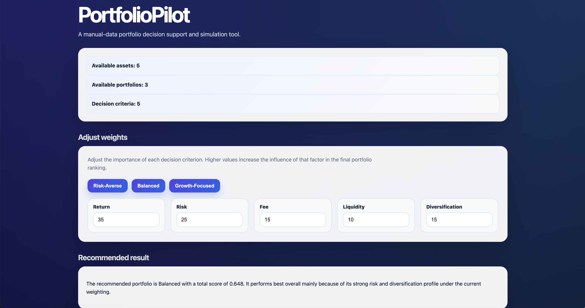
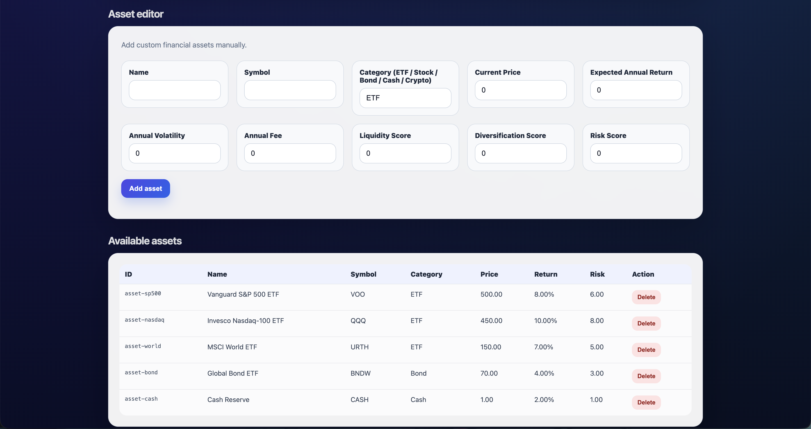
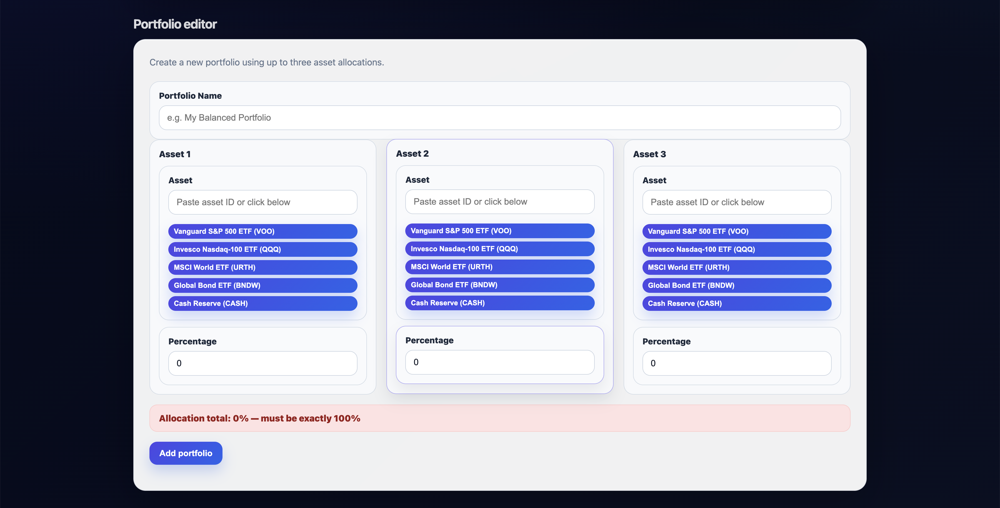
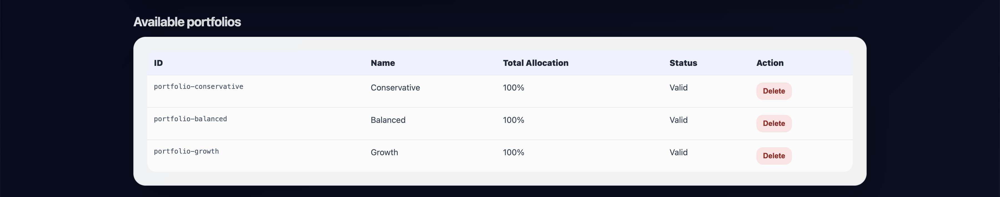
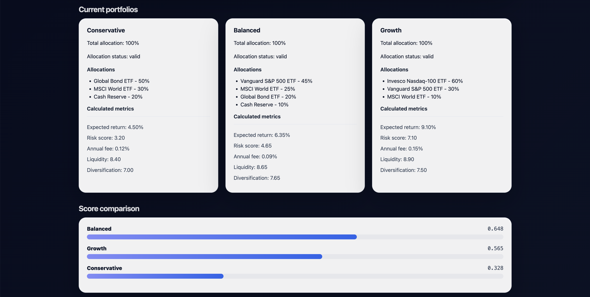
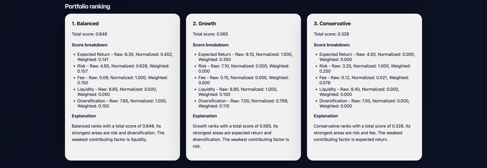
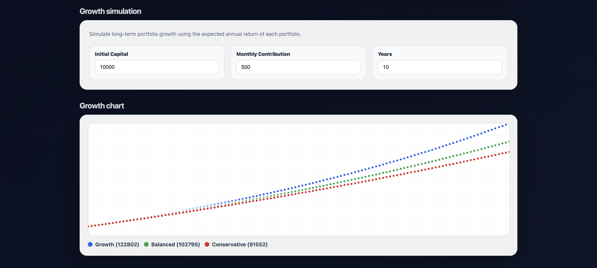
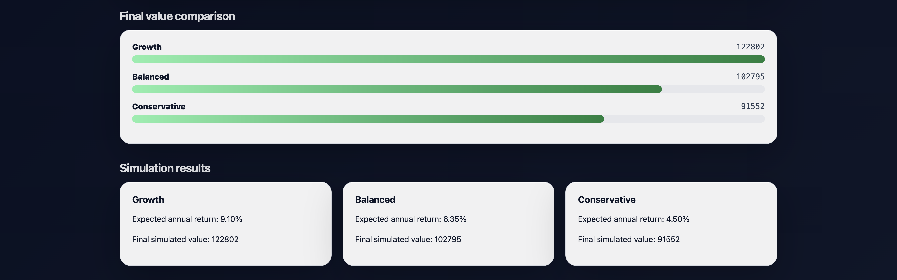
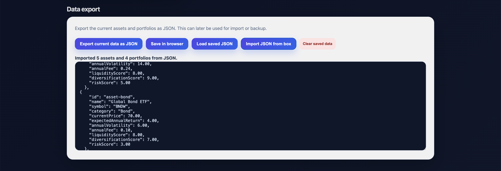

# PortfolioPilot – Portfolio Decision Support & Investment Simulation




---

## Motivation

Investment decisions are inherently multi-dimensional.

A portfolio with the highest expected return may also carry excessive risk, low liquidity, poor diversification, or high management fees.

Most beginner investment tools simplify portfolio comparison into a single metric, which often produces misleading conclusions.

The goal of PortfolioPilot is to model portfolio selection as a **multi-criteria decision support problem**, where multiple financial factors are weighted, normalized, and evaluated simultaneously.

In addition to ranking portfolios, the system also performs long-term growth simulations to visualize how investment strategies may evolve over time.

---

## Features

### Core

- Manual financial asset management
- Portfolio creation with custom allocations
- Multi-criteria portfolio ranking
- Weighted decision scoring
- Long-term growth simulation
- JSON export functionality

### Advanced

- **Weighted decision engine**
  - configurable importance values
  - return vs risk balancing
  - normalization-based scoring

- **Portfolio simulation**
  - monthly contribution support
  - compound growth modeling
  - long-term projection analysis

- **Dynamic visualization**
  - portfolio comparison bars
  - growth charts
  - ranking panels
  - simulation summaries

- **Browser persistence**
  - save current data locally
  - reload saved portfolios
  - offline-compatible workflow

---

## Decision Model

### Portfolio scoring

Each portfolio is evaluated using multiple weighted criteria:

| Criterion       | Type    |
| --------------- | ------- |
| Expected Return | Benefit |
| Risk            | Cost    |
| Annual Fee      | Cost    |
| Liquidity       | Benefit |
| Diversification | Benefit |

The scoring engine normalizes all portfolio metrics before applying weighted calculations.

---

### Weighted ranking system

The final portfolio score is determined by:

- metric normalization
- criterion weighting
- weighted aggregation

This allows users to prioritize:

- aggressive growth
- low risk
- diversification
- liquidity
- fee minimization

---

### Growth simulation

The system simulates long-term investment growth using:

- initial capital
- monthly contributions
- expected annual return
- compound growth

This enables:

- portfolio comparison over time
- long-term strategy evaluation
- future value estimation

---

## UI

### Inputs

- Asset parameters
- Portfolio allocations
- Decision weights
- Initial capital
- Monthly contribution
- Investment duration

---

### Outputs

- Portfolio rankings
- Weighted scores
- Growth charts
- Final portfolio values
- Portfolio explanations
- JSON export file

---

## Tech Stack

- **F#**
- **WebSharper UI**
- Reactive UI (Var / View)
- Functional domain modeling
- Browser LocalStorage API

---

## Installation

### Requirements

- .NET 10 SDK
- Node.js
- npm

### Clone the repository

```bash
git clone https://github.com/szrich83/PortfolioPilot.git
cd PortfolioPilot
```

### Install dependencies

```bash
dotnet restore
npm install
```

### Build

```bash
dotnet build -c Release
```

### Run the project

```bash
dotnet run
```

Then open the URL shown in the terminal.

---

## Project Structure

```text
PortfolioPilot/
├── src/
│   ├── Client.fs              # Main WebSharper SPA UI
│   ├── Models.fs              # Domain models
│   ├── Samples.fs             # Demo assets and portfolios
│   ├── Scoring.fs             # Multi-criteria scoring engine
│   ├── PortfolioMetrics.fs    # Portfolio metric calculations
│   ├── Simulation.fs          # Investment growth simulation
│   ├── Explanation.fs         # Ranking explanations
├── wwwroot/
│   ├── custom.css             # Styling and dashboard UI
├── index.html                 # Entry point
```

---

## Screenshots

### Main dashboard


### Asset editor



### Portfolio editor





### Portfolio ranking



### Growth simulation




### JSON export and browser storage



---

## Future Improvements

- JSON import support
- CSV import/export
- Historical market data
- Monte Carlo simulation
- Portfolio optimization algorithms
- Backend database support
- User authentication
- Real-time financial APIs

---

## Live Demo

https://portfoliopilot-yx7c.onrender.com/

---

## Author

Richárd Szőke  
GNMH44  
Software Engineering Student

---
